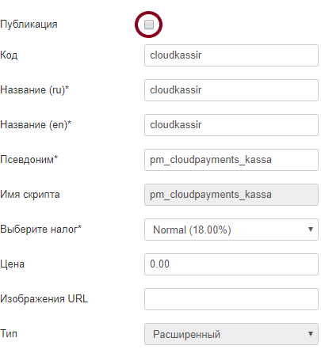
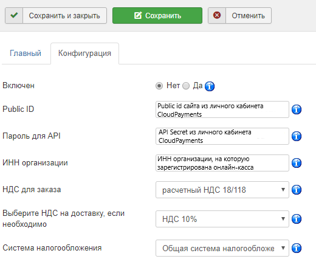

# Cloudkassir модуль для Joomla JoomShop

Модуль позволяет интегрировать онлайн-кассу [CloudKassir](https://cloudkassir.ru/) в интернет-магазин на платформе Joomla - JoomShopping.
Для корректной работы модуля необходима регистрация в сервисе.
Порядок регистрации описан в [документации CloudKassir](https://cloudkassir.ru/#subscribe).

## Возможности:

* Автоматическая отправка чеков прихода;
* Отправка чеков возврата прихода;
* Отправка чеков на email клиента;
* Отправка чеков по SMS;

## Совместимость:
JoomShopping v.4.15.0 и выше;  
Joomla v.3.8.2 и выше.

_Если вы используете платежный модуль CloudPayments совместно с модулем CloudKassir, то убедитесь, что в платежном модуле отключена отправка чеков через онлайн-кассу, во избежание дублирования кассовых чеков._

### Установка через панель управления
1. Зайдите в инсталлятор расширений  
"Расширения" -> "Менеджер расширений" -> "Установка" -> "Загрузить фаил пакета"  
`/administrator/index.php?option=com_installer` и загрузите архив.
2. Далее в настройках модуля  
"Компоненты" -> "JoomShopping" -> "Опции" -> "Способо оплаты"  
`/administrator/index.php?option=com_jshopping&controller=payments`  
добавьте новый способ оплаты: прописывая нужный псевдоним и имя скрипта -  
`pm_cloudpayments_kassa`- **это обязательный пункт!!!**
3. **Не публикуйте молуль**, в противном случае он появится в списке возмоных способов для оплаты. Он не является платёжным!  

### Настройка модуля Cloudpayments

Далее, перейдите в в настройки модуля, вкладка "Конфигурация":  

* **Включен** - Включение/отключение модулья.
* **Public_id** - Public id сайта из личного кабинета CloudPayments;
* **Password for API** - API Secret из личного кабинета CloudPayments;
* **ИНН организации** - ИНН организации, на которую зарегистрирована онлайн-касса;
* **НДС для заказа** - Указажите ставки НДС товаров. Все возможные значения указаны в [документации](https://cloudpayments.ru/wiki/integration/products/onlinekassa#data-format);
* **Выберите НДС на доставку, если необходимо** - Ставка НДС службы доставки. Если доставка платная, то она в чеке оформляется отдельной строкой со своей ставкой НДС.
Значения аналогично ставке НДС для товаров;
* **Система налогооблажения** - Тип системы налогообложения. Возможные значения перечислены в [документации CloudPayments](https://cloudpayments.ru/Docs/Directory#taxation-system).
